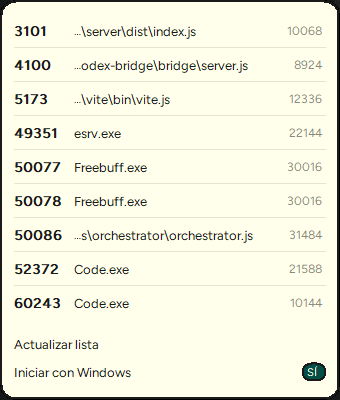

# GLORYPORT

Gestor minimalista de puertos TCP para **Windows 10/11 (64 bits)**, desde la bandeja del
sistema. Lista los puertos en escucha y termina el proceso que los ocupa en un clic.

Inspirado en [port-killer](https://github.com/productdevbook/port-killer), pero **desde
cero, solo Windows, un solo binario Rust nativo**: sin Electron, sin runtime externo, sin
procesos hijos (`netstat`, `taskkill`, `reg.exe`), sin timers en background.


Popup de bandeja estilo **Wispr Flow** (paleta crema/tinta/lavanda, Figtree + EB Garamond
embebidas), compacto y pintado con GDI:



## Características

- Bandeja del sistema con popup estilizado de puertos en escucha (puerto, proceso, PID),
  ordenado y deduplicado (IPv4/IPv6 del mismo proceso = una fila), con aire generoso en el
  layout y **solo aplicaciones de usuario**: los puertos/servicios del sistema (p. ej. el
  PID 4, `C:\Windows`, puertos < 1024) quedan ocultos para no ofrecer un kill inútil.
- Kill con confirmación implícita: un clic termina el proceso y muestra notificación con el
  resultado (éxito o error con motivo real, p. ej. acceso denegado).
- Auto-inicio opcional vía clave `Run` de HKCU (sin `reg.exe`).
- Instancia única: una segunda copia notifica a la primera y sale sola.
- CLI para scripting: `list` (tabla o JSON, con `--incluir-sistema` para ver todo) y
  `kill <puerto>` con exit codes.
- Bajo consumo: sin refresco automático, ~0 % CPU en reposo, ~1,5–2,5 MB de RAM privada en
  bandeja (WorkingSet ~10–17 MB según el sistema), binario release de ~348 KB (0,34 MB).

## Requisitos

- Windows 10/11 64 bits.
- Rust 1.85+ (toolchain MSVC) solo para compilar desde fuente.

## Compilar

```powershell
cargo build --release
.\target\release\gloryport.exe --version
```

El binario es autocontenido (el icono va embebido); no requiere instalar nada más.

## Uso

### Bandeja (modo principal)

```powershell
gloryport          # o: gloryport tray
```

Aparece el icono en la bandeja. Un clic abre el popup con la lista de puertos; cada fila
muestra `puerto  proceso (PID)`; solo aparecen aplicaciones de usuario (ver filtro abajo).
Un segundo clic en el icono (o un clic fuera del popup) lo cierra, como un menú nativo. El
popup incluye:

- **Actualizar**: re-escanea la tabla TCP.
- **Auto-inicio**: activa/desactiva el arranque con Windows (HKCU).

Si hay más de 60 puertos, el popup se desplaza con la rueda del ratón (máx. 9 filas
visibles). No hay cabecera ni contador: el popup es compacto y se abre sobre el cursor.
El cursor se mantiene como flecha al pasar por encima (sin el cursor de espera que
aparecía antes) y, si la ruta del proceso no cabe en la fila, se recorta por el principio
conservando el final (`…\codex-bridge\bridge\server.js` en vez de cortar la cola).

### Filtro de aplicaciones

Por defecto el popup y `list` muestran solo **aplicaciones de usuario**: puerto ≥ 1024 y
ejecutable resuelto fuera de `C:\Windows`. Los servicios del sistema (PID 0/4, `svchost`,
`lsass`, etc.) y los sincronizadores de fondo (p. ej. `GoogleDriveFS.exe`, ignorado por
blocklist) no aparecen porque no deben cerrarse. Para ver todo en la CLI:

```powershell
gloryport list --incluir-sistema
```

El "desconocido" que aparecía antes en el popup eran procesos que murieron entre el escaneo
y la consulta del nombre, o servicios del sistema sin acceso de lectura (p. ej. de otro
usuario). Con `QueryFullProcessImageNameW` ahora se resuelve la ruta completa del ejecutable
y, con el filtro aplicado, esos procesos ya no se muestran en el popup.

Para los intérpretes (`node.exe`, `bun.exe`, `deno…`) la columna PROCESO muestra el script
que realmente sirve el puerto, leído de la línea de comandos del proceso (PEB vía
`NtQueryInformationProcess`, sin WMI ni procesos hijos): `…\codex-bridge\bridge\server.js`
en vez de `node.exe`. La etiqueta se deriva del proceso real de cada escaneo — no hay un
mapa puerto→aplicación — porque una misma app puede ocupar puertos distintos en días
distintos.

> Nota: al invocar la CLI desde PowerShell, el binario usa subsistema gráfico (sin ventana
> de consola al arrancar como app); si una salida se ve truncada por el host, usa `cmd /c`
> o redirige a archivo. En `cmd` y en llamadas programáticas la salida es completa.

### CLI

```powershell
gloryport list                # tabla: puerto, dirección, PID, proceso
gloryport list --incluir-sistema  # incluye servicios/puertos del sistema
gloryport list --json         # mismo resultado en JSON (útil para scripting)
gloryport kill 3000           # termina los procesos que escuchan en el puerto 3000
gloryport kill 3000 --pid 1234  # filtra por PID (si hay varios dueños)
gloryport --version
gloryport --help
```

Ejemplo:

```text
PUERTO  DIRECCIÓN             PID      PROCESO
3101    127.0.0.1             10068    …\server\dist\index.js
4100    127.0.0.1             8924     …\codex-bridge\bridge\server.js
5173    [::1]                 12336    …\vite\bin\vite.js
49351   127.0.0.1             22144    esrv.exe
```

Exit codes: `0` éxito, `1` error de ejecución (p. ej. puerto libre o acceso denegado),
`2` error de uso de argumentos.

## Arquitectura y planificación

- [docs/arquitectura.md](docs/arquitectura.md) — decisiones de stack, módulos, flujos,
  seguridad, estrategia de recursos y Definition of Done.
- [roadmap.md](roadmap.md) — cola operativa y fases futuras.
- [AGENTS.md](AGENTS.md) — contrato del proyecto y gate de calidad.

## Calidad verificada

| Chequeo | Resultado |
|---|---|
| `cargo test` | 24/24 OK (21 unit + 3 E2E con puerto real) |
| `cargo clippy --all-targets -- -D warnings` | OK |
| `cargo fmt --check` | OK |
| Smoke bandeja | Icono en bandeja; clic físico abre el popup 340×400 en < 130 ms, estable, 2.º clic cierra sin reabrir |
| RAM en bandeja | WorkingSet ~10 MB / privada ~1,5 MB, 4 hilos |
| `gloryport list` (release) | instantáneo con el filtro de aplicaciones |
| Binario release | 350.208 bytes (~342 KB), autocontenido (icono + fuentes) |

## Límites conocidos

- Solo TCP (IPv4 + IPv6) en escucha; no cubre UDP ni conexiones establecidas.
- Sin elevación: un proceso protegido (p. ej. SYSTEM) reporta el error real en lugar de
  pedir permisos de administrador.
- En el popup solo se ofrecen aplicaciones de usuario; los servicios del sistema quedan
  fuera por diseño. En `list --incluir-sistema`, un proceso muerto entre el escaneo y la
  consulta, o sin permiso de lectura (servicios de otro usuario/SYSTEM), aparece como
  "desconocido" con su ruta vacía (caché TTL 10 s).

## Hoja de ruta futura

Vigilancia de puertos configurados, instalador ligero/firma y re-verificación del PID justo
antes del kill — detalle y prioridad en [roadmap.md](roadmap.md).

## Licencia

MIT (ver `Cargo.toml`).
