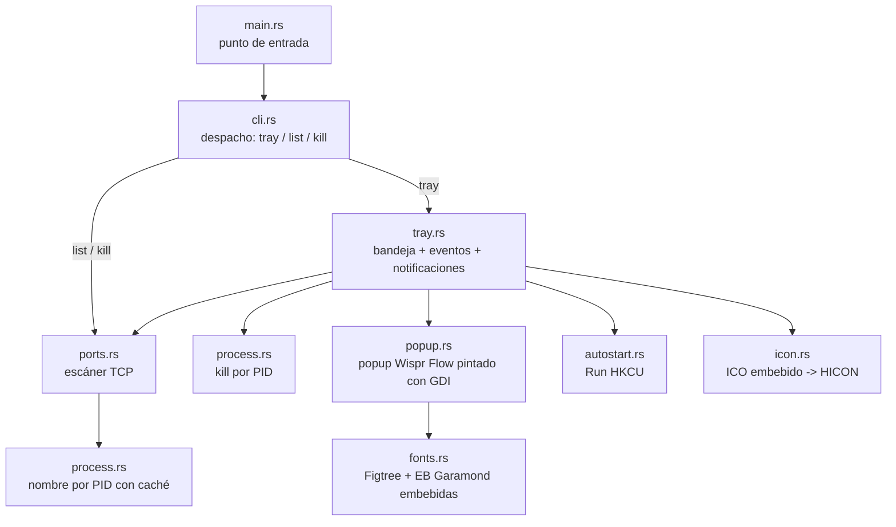
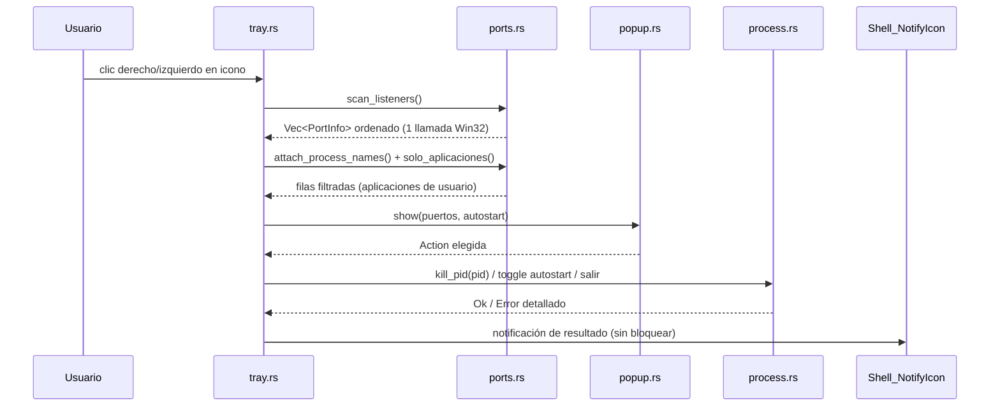

# GLORYPORT — Arquitectura y plan

Fecha: 2026-08-12 · Estado: v1.3 implementada (popup compacto, cmdline de intérpretes,
blocklist y elipsis al inicio) · Fuente de decisión
canónica: este documento.

## 1. Contexto y objetivo

GLORYPORT es un reemplazo *desde cero*, minimalista y solo Windows, de herramientas tipo
[port-killer](https://github.com/productdevbook/port-killer): el desarrollador necesita ver
qué proceso ocupa un puerto TCP y poder terminarlo en un clic.

La referencia resuelve esto con un core Rust + tres UIs nativas (SwiftUI, WPF, GTK), más
funciones de producto (k8s, tunnels, favoritos, vigilancia) que no son parte de este pedido.
GLORYPORT reduce el problema a su núcleo con criterios explícitos:

1. **Solo Windows** (Windows 10/11, 64 bits).
2. **Bandeja del sistema** como única interfaz permanente; sin ventana principal.
3. **Bajo consumo**: sin timers, sin procesos externos, sin runtime ajeno.
4. **Rápido**: escaneo con una llamada Win32 directa a la tabla TCP del sistema.
5. **Estable**: un solo hilo, errores explícitos, single-instance, cleanup garantizado.
6. **Bien planificado**: arquitectura documentada, gate de calidad y roadmap (este
   documento + `roadmap.md` + plan cerrado en `Agente/planes/completados/`).

### No-goals (v1)

- No gestiona UDP, k8s, tunnels, Cloudflare ni VPNs.
- No tiene ventana principal, buscador, favoritos ni notificaciones de puertos vigilados.
- No pide elevación: solo puede matar procesos con permisos del usuario actual. Un proceso
  que exija SYSTEM reportará el error real en vez de escalar.
- No es un servicio de Windows: es una app de sesión de usuario.

## 2. Decisión de stack

| Opción | Memoria aprox. | Binario | Runtime | Bandeja | Veredicto |
|---|---|---|---|---|---|
| **Rust + Win32 (`windows` crate)** | 2–6 MB | ~0,6–1,5 MB | Ninguno | Nativa | **Elegido** |
| C# WPF/.NET | 60–120 MB | ~1 MB + runtime | .NET (grande) | Nativa | Rechazado: runtime y huella altos |
| Tauri (WebView2) | 100+ MB | pequeño | WebView2 | Sí | Rechazado: no es minimalista |
| Go + systray | 8–15 MB | ~3–5 MB | Ninguno | Nativa | Rechazado: API Win32 menos directa |
| Swift (referencia) | — | — | — | — | Rechazado: es el stack de la referencia, no Windows-first |

Razones del stack elegido:

- `GetExtendedTcpTable` (iphlpapi) da la tabla de escucha con PID en una sola llamada; sin
  `netstat`, sin procesos hijos, sin parsing de texto.
- `windows` crate es el binding oficial mantenido; con features acotadas el binario queda
  pequeño y el código es verificable por revisión.
- Sin async/tokio: el bucle de eventos Win32 puro es suficiente y evita runtime y threads.
- `panic = "abort"` + `strip` + `lto` reducen tamaño y superficie.

## 3. Arquitectura de módulos



Cada módulo tiene una responsabilidad única y sus pruebas unitarias junto al código.

## 4. Flujo principal (bandeja)



No existe refresco automático: el menú se reconstruye completo en cada apertura. Esto es lo
que mantiene el consumo de CPU en ~0% cuando la app está inactiva.

### Gotcha del clic en el icono (NOTIFYICON_VERSION_4)

Con `NIM_SETVERSION` a `NOTIFYICON_VERSION_4`, el shell empaqueta el identificador del icono
en la **palabra alta** de `lParam` del callback: `lParam = (uID << 16) | mensaje_de_ratón`.
El handler debe comparar `lParam & 0xFFFF`, no el valor completo; comparar el valor completo
rompe el clic físico (los mensajes `PostMessage` de prueba sí llegaban limpios y enmascaraban
el bug). Además, un clic real entrega `WM_LBUTTONDOWN`/`WM_LBUTTONUP` y un `NIN_SELECT`
(`WM_USER`) que debe ignorarse; el clic derecho entrega `WM_CONTEXTMENU`.

El popup **no usa captura de ratón** (si capturara, el segundo clic en el icono cerraba el
popup por la captura y el shell reenviaba el `WM_LBUTTONUP` que lo reabría). El cierre por
clic fuera se resuelve con `WM_ACTIVATE` (`WA_INACTIVE`), como un menú nativo.

### Carrera del segundo clic (cerrar → reabrir)

Un clic en el icono mientras el popup está abierto genera dos eventos: el *DOWN* sobre la
bandeja desactiva el popup (`WM_ACTIVATE` → cierre) y el *UP* posterior llega al callback de
bandeja (`WM_APP_TRAY`) cuando el popup ya está cerrado, reabriéndolo al instante (verificado
en smoke: el HWND del popup cambiaba en la misma posición). El fix es una **ventana de
supresión** de 250 ms: `popup::record_close()` registra la hora del último cierre y
`toggle_or_show_menu()` consume el clic de bandeja que llega justo después de un cierre
reciente en vez de reabrir. No afecta a "Actualizar lista", que reabre el popup por la vía
interna (`show_menu`) y no por un clic de bandeja.

Si Explorer se reinicia, el shell envía `TaskbarCreated` (mensaje registrado con
`RegisterWindowMessageW`); el tray vuelve a llamar `Shell_NotifyIconW(NIM_ADD)` con la
misma ventana/icono para no perder el icono.

## 5. Modelo de datos

```rust
pub struct PortInfo {
    pub port: u16,          // puerto en escucha
    pub pid: u32,           // PID del proceso dueño
    pub address: String,    // "0.0.0.0", "127.0.0.1", "[::1]"
    pub process_name: String, // nombre base del ejecutable, con caché TTL
    pub process_path: Option<String>, // ruta completa del ejecutable (None: sin permiso/muerto)
    pub process_cmd: Option<String>,  // línea de comandos completa (None: sin permiso/muerto)
}
```

Reglas:

- Se deduplica por `(port, pid)`: si un mismo proceso escucha en IPv4 e IPv6, aparece una
  sola fila.
- Orden: puerto ascendente; estable para el usuario.
- Límite de visibilidad en menú: 60 entradas (máx. 9 filas visibles, scroll de rueda).
- La ruta se resuelve con `QueryFullProcessImageNameW` (permisos mínimos
  `PROCESS_QUERY_LIMITED_INFORMATION`) y la línea de comandos con
  `NtQueryInformationProcess` + `ReadProcessMemory` sobre el PEB (x64,
  `PROCESS_QUERY_INFORMATION | PROCESS_VM_READ`, sin WMI ni procesos hijos); una sola
  apertura del proceso devuelve nombre, ruta y cmdline.

### Etiqueta visible y cmdline (128A-12)

`ports::etiqueta_visible()` muestra el "programa real" de cada fila:

- Para intérpretes (`node.exe`, `bun.exe`, `deno…`), busca el primer argumento de la
  línea de comandos con extensión de script (`js/mjs/cjs/ts/mts/cts`), normaliza la ruta
  (colapsa `.` y `..`) y la acorta a sus últimos 3 componentes: `…\codex-bridge\bridge\server.js`.
- Para el resto, el nombre base del ejecutable (`esrv.exe`, `Code.exe`, `Freebuff.exe`).
- La etiqueta se deriva del proceso real de cada escaneo: **nunca** hay un mapa
  puerto→aplicación, porque una misma app puede ocupar puertos distintos en días distintos.

La cmdline también se expone en `list --json` (`process_cmd`) para scripting.

### Elipsis al inicio (128A-12)

`DT_BEGINNING_ELLIPSIS` no existe en Win32, así que `popup.rs` recorta por el principio con
`text_leading_ellipsis()`: mide el texto con `GetTextExtentPoint32W` y, si no cabe en la
fila, busca por búsqueda binaria la cola más larga que quepa anteponiendo `…`. Resultado:
cuando la ruta no cabe se ve el **final** (`…\bridge\server.js`) y no el comienzo.

### Filtro "solo aplicaciones" (128A-10)

El popup y `list` aplican `ports::solo_aplicaciones()`: se muestra una fila solo si
`puerto >= 1024` **y** la ruta resuelta cae **fuera** de `C:\Windows` (comparación
case-insensitive contra `SystemRoot`) **y** el proceso no está en la blocklist
(`PROCESOS_EXCLUIDOS`, p. ej. `googledrivefs.exe`). Consecuencias:

- Los servicios del sistema (PID 0/4, `svchost`, `lsass`, `TermService`, etc.) y los
  puertos comunes (< 1024) no aparecen en el popup: no tienen sentido como objetivo de kill.
- Los procesos muertos entre el escaneo y la consulta, o sin permiso de lectura (otro
  usuario/SYSTEM), tienen `process_path = None` y también quedan ocultos: es la eliminación
  del "desconocido" del popup.
- Los sincronizadores/auxiliares de fondo que cumplirían el filtro pero nunca deben
  cerrarse (GoogleDriveFS) quedan excluidos por blocklist.
- `gloryport list --incluir-sistema` desactiva el filtro (ver todo, incluidos los no
  resueltos como "desconocido").

El criterio es "aplicaciones de usuario" y no "solo la carpeta `area-trabajo`": los binarios
de desarrollo (`node.exe`, `bun.exe`) viven en `Program Files` y un filtro estricto por
carpeta ocultaría los servidores de los proyectos.

## 6. Estrategia de recursos

| Recurso | Estrategia |
|---|---|
| CPU | Sin timers. Escaneo solo bajo demanda (apertura de menú o CLI). |
| RAM | Una sola tabla escaneada; caché de nombre+ruta+cmdline con TTL 10 s y tope de 512 entradas. |
| Procesos hijos | Cero: todas las operaciones vía API Win32. |
| Arranque | Mutex de instancia única + registro de clase + `Shell_NotifyIcon`; sin red. |
| Disco | El binario es autocontenido (icono y fuentes embebidas). |

Las fuentes Figtree (400/500/600) y EB Garamond (400) se cargan en memoria con
`AddFontMemResourceEx` desde TTFs incluidos en `assets/fonts/` (generados con
`tools/make-fonts.py` desde las variables oficiales), con fallback Segoe UI/Georgia. No se
escribe nada en disco y `fonts::cleanup()` las libera al salir.

Objetivos medibles (v1, verificados en §10):

- RAM privada de la app en bandeja: < 3 MB (WorkingSet ~10–17 MB según el sistema).
- Tamaño `gloryport.exe` release: < 1,5 MB.
- `gloryport list` (escaneo + nombres): < 100 ms en máquina típica.

## 7. Manejo de errores

- El escáner distingue: tabla vacía (OK), fallo de API (error con código Win32), PID sin
  nombre resoluble (se muestra "desconocido", no falla el escaneo).
- El kill distingue: acceso denegado, proceso inexistente, PID protegido (0/4/propio) y
  error Win32. En bandeja se muestra notificación; en CLI, mensaje a stderr + exit code.
- En el bucle de mensajes, cualquier fallo de creación (clase, ventana, icono) se reporta
  con `GetLastError` y termina con código ≠ 0.
- Cleanup garantizado: al salir se elimina el icono (`NIM_DELETE`), se destruye menú y
  ventana, se liberan las fuentes (`fonts::cleanup()`) y el mutex (RAII).

## 8. Seguridad

- Permisos mínimos: `OpenProcess(PROCESS_TERMINATE)`; no se abre con `PROCESS_ALL_ACCESS`.
- Se niega matar el propio GLORYPORT, PID 0 y PID 4 (System).
- Auto-inicio: solo HKCU (sin privilegios de administrador), escribible y reverted por el
  usuario; el valor apunta al ejecutable actual entre comillas.
- Single-instance por mutex de sesión; la segunda instancia notifica a la primera y sale.
- Sin red, sin datos del usuario fuera de la clave Run, sin elevación.
- Lectura de cmdline solo con permisos de consulta/lectura de memoria; falla (None) ante
  procesos de sistema u otro usuario, sin elevar privilegios.

## 9. Estrategia de pruebas

1. **Unitarias**: formateo de dirección IP (v4/v6), decodificación de puerto (network byte
   order), dedupe/orden, layout del popup (altura, filas visibles, scroll, hit-test),
   construcción de etiquetas, parseo de args CLI, filtro `solo_aplicaciones`, supresión de
   reapertura del segundo clic, cmdline del propio proceso (PEB) y elipsis al inicio.
2. **Integración E2E** (en `tests/`): el binario auxiliar `gloryport-test-helper` ocupa un
   puerto real; se verifica que `list` lo muestra y que `kill` lo libera (el proceso termina
   y el puerto queda libre).
3. **Smoke de bandeja** (`tools/smoke-tray.ps1`): arrancar `gloryport tray`, encontrar el
   icono por UIA, clic físico real (`SendInput` con coordenadas absolutas sobre el icono),
   verificar popup visible, capturar PNG y confirmar que el segundo clic lo cierra sin
   reabrir (sonda HWND/rect antes y después para distinguir cierre de reapertura).
4. **Gate**: `cargo fmt --check`, `cargo clippy --all-targets -- -D warnings`, `cargo test`,
   build release, ejecutar el binario release para `list`.

## 10. Fases y estado

| Fase | Alcance | Estado |
|---|---|---|
| P0 | Arquitectura, plan, estructura, gate del proyecto | Hecho |
| P1 | Núcleo: escáner, nombres, kill, CLI (`list`, `kill`, `--version`) | Hecho |
| P2 | Bandeja: icono, menú, notificaciones, single-instance, auto-inicio | Hecho |
| P3 | Calidad: tests, clippy, E2E real, smoke tray, release | Hecho |
| P4 | Cierre: docs, roadmap, completados, commit final | Hecho |
| P7 | Popup Wispr Flow (GDI, fuentes embebidas) + fix clic físico del icono | Hecho |
| P8 | Popup amplio sin título/contador + filtro solo-aplicaciones + fix carrera del 2.º clic | Hecho |
| P9 | Popup sin Salir/Acerca, fix cursor de espera, blocklist (GoogleDriveFS), cmdline de intérpretes (node/bun) y elipsis al inicio | Hecho |
| P5 (futuro) | Refresco automático configurable, puertos vigilados | Pendiente (roadmap) |
| P6 (futuro) | Instalador ligero / firma de código, actualización | Pendiente (roadmap) |

## 11. Definition of Done (v1)

- `gloryport tray`: icono en bandeja, menú con puertos reales, kill con notificación,
  auto-inicio verificable, single-instance, cierre limpio.
- Popup Wispr Flow: el clic físico abre el popup estilizado en el cursor (340×400, sin
  cabecera ni contador, sin Salir/Acerca), el cursor se mantiene como flecha al pasar por
  encima, se mantiene estable sin interacción y el segundo clic o un clic fuera lo cierra
  sin reabrir.
- `gloryport list`: tabla correcta (puerto, dirección, PID, proceso), `--json` y
  `--incluir-sistema` para ver servicios del sistema.
- `gloryport kill <puerto>`: termina el/los proceso(s) y reporta resultado con exit code.
- Gate verde (fmt, clippy `-D warnings`, tests unit + E2E) y smoke de bandeja aprobado.
- Documentación (este archivo, README, roadmap, plan) coherente con la implementación.
