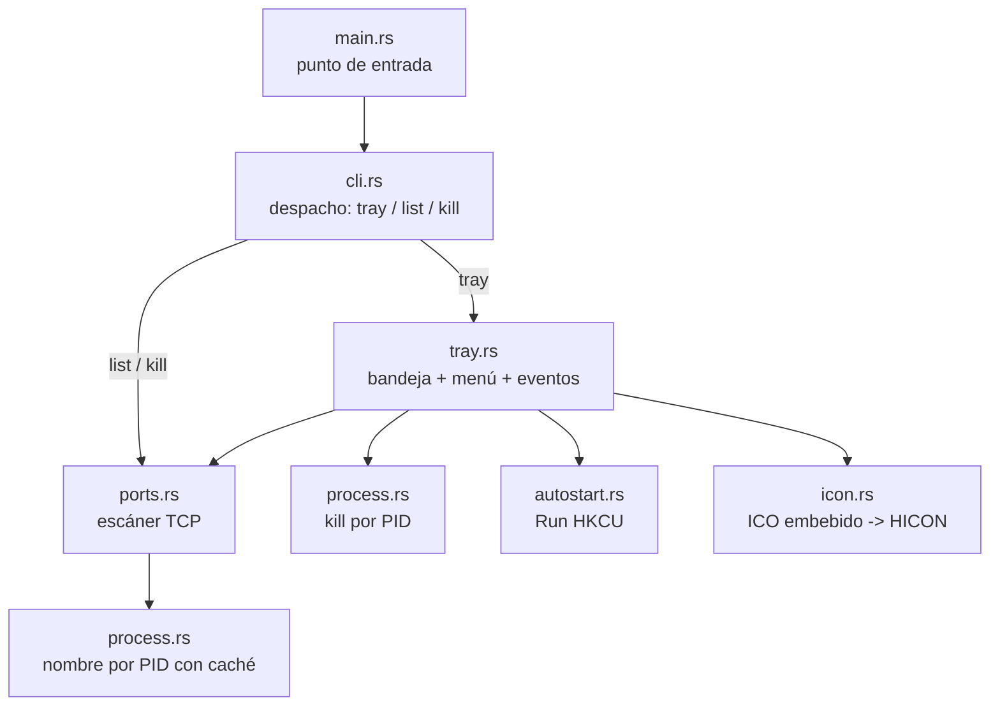
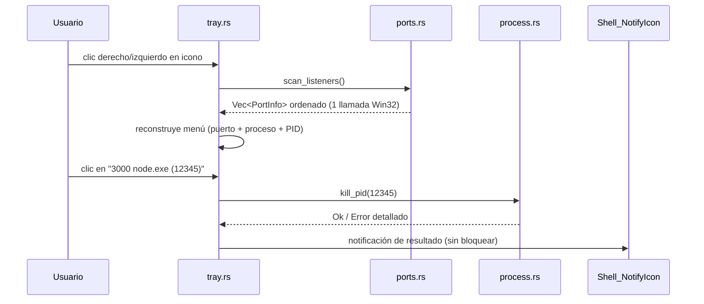

# GLORYPORT — Arquitectura y plan

Fecha: 2026-08-12 · Estado: v1 implementada · Fuente de decisión canónica: este documento.

## 1. Contexto y objetivo

GLORYPORT es un reemplazo *desde cero*, minimalista y solo Windows, de herramientas tipo
[port-killer](https://github.com/productdevbook/port-killer): el desarrollador necesita ver
qué proceso ocupa un puerto TCP y poder terminarlo en un clic.

La referencia resuelve esto con un core Rust + tres UIs nativas (SwiftUI, WPF, GTK), más
funciones de producto (k8s, tunnels, favoritos, vigilancia) que no son parte de este pedido.
GLORYPORT reduce el problema a su núcleo con criterios explícitos:

1. **Solo Windows** (Windows 10/11, 64 bits).
2. **Bandeja del sistema** como única interfaz permanente; sin ventana principal.
3. **Bajo consumo**: sin timers, sin procesos externos, sin runtime ajeno.
4. **Rápido**: escaneo con una llamada Win32 directa a la tabla TCP del sistema.
5. **Estable**: un solo hilo, errores explícitos, single-instance, cleanup garantizado.
6. **Bien planificado**: arquitectura documentada, gate de calidad y roadmap (este
   documento + `roadmap.md` + plan cerrado en `Agente/planes/completados/`).

### No-goals (v1)

- No gestiona UDP, k8s, tunnels, Cloudflare ni VPNs.
- No tiene ventana principal, buscador, favoritos ni notificaciones de puertos vigilados.
- No pide elevación: solo puede matar procesos con permisos del usuario actual. Un proceso
  que exija SYSTEM reportará el error real en vez de escalar.
- No es un servicio de Windows: es una app de sesión de usuario.

## 2. Decisión de stack

| Opción | Memoria aprox. | Binario | Runtime | Bandeja | Veredicto |
|---|---|---|---|---|---|
| **Rust + Win32 (`windows` crate)** | 2–6 MB | ~0,6–1,5 MB | Ninguno | Nativa | **Elegido** |
| C# WPF/.NET | 60–120 MB | ~1 MB + runtime | .NET (grande) | Nativa | Rechazado: runtime y huella altos |
| Tauri (WebView2) | 100+ MB | pequeño | WebView2 | Sí | Rechazado: no es minimalista |
| Go + systray | 8–15 MB | ~3–5 MB | Ninguno | Nativa | Rechazado: API Win32 menos directa |
| Swift (referencia) | — | — | — | — | Rechazado: es el stack de la referencia, no Windows-first |

Razones del stack elegido:

- `GetExtendedTcpTable` (iphlpapi) da la tabla de escucha con PID en una sola llamada; sin
  `netstat`, sin procesos hijos, sin parsing de texto.
- `windows` crate es el binding oficial mantenido; con features acotadas el binario queda
  pequeño y el código es verificable por revisión.
- Sin async/tokio: el bucle de eventos Win32 puro es suficiente y evita runtime y threads.
- `panic = "abort"` + `strip` + `lto` reducen tamaño y superficie.

## 3. Arquitectura de módulos



Cada módulo tiene una responsabilidad única y sus pruebas unitarias junto al código.

## 4. Flujo principal (bandeja)



No existe refresco automático: el menú se reconstruye completo en cada apertura. Esto es lo
que mantiene el consumo de CPU en ~0% cuando la app está inactiva.

## 5. Modelo de datos

```rust
pub struct PortInfo {
    pub port: u16,          // puerto en escucha
    pub pid: u32,           // PID del proceso dueño
    pub address: String,    // "0.0.0.0", "127.0.0.1", "[::1]"
    pub process_name: String, // nombre base del ejecutable, con caché TTL
}
```

Reglas:

- Se deduplica por `(port, pid)`: si un mismo proceso escucha en IPv4 e IPv6, aparece una
  sola fila.
- Orden: puerto ascendente; estable para el usuario.
- Límite de visibilidad en menú: 60 entradas; si hay más, se indica con un item informativo.
- PID 0/4 (System) se listan pero su kill devuelve error controlado (permisos).

## 6. Estrategia de recursos

| Recurso | Estrategia |
|---|---|
| CPU | Sin timers. Escaneo solo bajo demanda (apertura de menú o CLI). |
| RAM | Una sola tabla escaneada; caché de nombres con TTL 10 s y tope de 512 entradas. |
| Procesos hijos | Cero: todas las operaciones vía API Win32. |
| Arranque | Mutex de instancia única + registro de clase + `Shell_NotifyIcon`; sin red. |
| Disco | El binario es autocontenido (icono embebido `include_bytes!`). |

Objetivos medibles (v1, verificados en §10):

- RAM privada de la app en bandeja: < 3 MB (WorkingSet ~10–17 MB según el sistema).
- Tamaño `gloryport.exe` release: < 1,5 MB.
- `gloryport list` (escaneo + nombres): < 100 ms en máquina típica.

## 7. Manejo de errores

- El escáner distingue: tabla vacía (OK), fallo de API (error con código Win32), PID sin
  nombre resoluble (se muestra "desconocido", no falla el escaneo).
- El kill distingue: acceso denegado, proceso inexistente, PID protegido (0/4/propio) y
  error Win32. En bandeja se muestra notificación; en CLI, mensaje a stderr + exit code.
- En el bucle de mensajes, cualquier fallo de creación (clase, ventana, icono) se reporta
  con `GetLastError` y termina con código ≠ 0.
- Cleanup garantizado: al salir se elimina el icono (`NIM_DELETE`), se destruye menú y
  ventana, y se libera el mutex (RAII).

## 8. Seguridad

- Permisos mínimos: `OpenProcess(PROCESS_TERMINATE)`; no se abre con `PROCESS_ALL_ACCESS`.
- Se niega matar el propio GLORYPORT, PID 0 y PID 4 (System).
- Auto-inicio: solo HKCU (sin privilegios de administrador), escribible y reverted por el
  usuario; el valor apunta al ejecutable actual entre comillas.
- Single-instance por mutex de sesión; la segunda instancia notifica a la primera y sale.
- Sin red, sin datos del usuario fuera de la clave Run, sin elevación.

## 9. Estrategia de pruebas

1. **Unitarias**: formateo de dirección IP (v4/v6), decodificación de puerto (network byte
   order), dedupe/orden, construcción de etiquetas de menú, parseo de args CLI.
2. **Integración E2E** (en `tests/`): el binario auxiliar `gloryport-test-helper` ocupa un
   puerto real; se verifica que `list` lo muestra y que `kill` lo libera (el proceso termina
   y el puerto queda libre).
3. **Smoke de bandeja**: arrancar `gloryport tray`, verificar ventana oculta creada,
   proceso vivo, segunda instancia que sale sola, y cierre limpio.
4. **Gate**: `cargo fmt --check`, `cargo clippy --all-targets -- -D warnings`, `cargo test`,
   build release, ejecutar el binario release para `list`.

## 10. Fases y estado

| Fase | Alcance | Estado |
|---|---|---|
| P0 | Arquitectura, plan, estructura, gate del proyecto | Hecho |
| P1 | Núcleo: escáner, nombres, kill, CLI (`list`, `kill`, `--version`) | Hecho |
| P2 | Bandeja: icono, menú, notificaciones, single-instance, auto-inicio | Hecho |
| P3 | Calidad: tests, clippy, E2E real, smoke tray, release | Hecho |
| P4 | Cierre: docs, roadmap, completados, commit final | Hecho |
| P5 (futuro) | Refresco automático configurable, puertos vigilados, PID→línea de comando | Pendiente (roadmap) |
| P6 (futuro) | Instalador ligero / firma de código, actualización | Pendiente (roadmap) |

## 11. Definition of Done (v1)

- `gloryport tray`: icono en bandeja, menú con puertos reales, kill con notificación,
  auto-inicio verificable, single-instance, cierre limpio.
- `gloryport list`: tabla correcta (puerto, dirección, PID, proceso) y `--json`.
- `gloryport kill <puerto>`: termina el/los proceso(s) y reporta resultado con exit code.
- Gate verde (fmt, clippy `-D warnings`, tests unit + E2E) y smoke de bandeja aprobado.
- Documentación (este archivo, README, roadmap, plan) coherente con la implementación.
